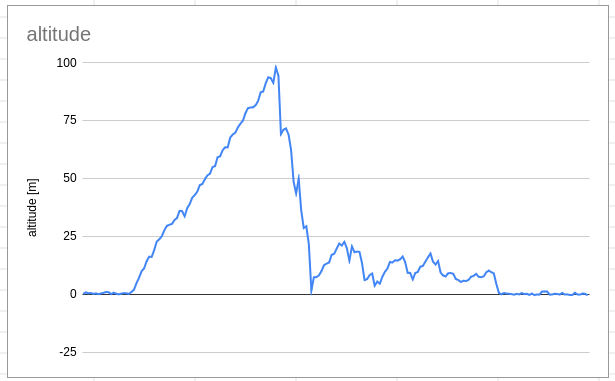

# Altilogger

## Altitude logger for RC aircraft

Records altitude using a BME280 sensor, and stores the data in flash to later be transferred to a computer



## Build and upload

- `arduino-cli core update-index`
- `arduino-cli compile`
- `arduino-cli upload --port /dev/ttyUSB0`
- `arduino-cli monitor --port /dev/ttyUSB0 --config 115200`

## Set up language server in neovim

include `nvim-init-lsp.lua`, for example by using `.nvimrc.lua`:

```
-- .nvimrc.lua

dofile("./nvim-init-lsp.lua")
```
